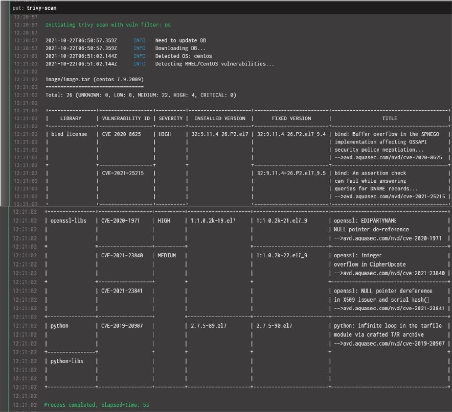
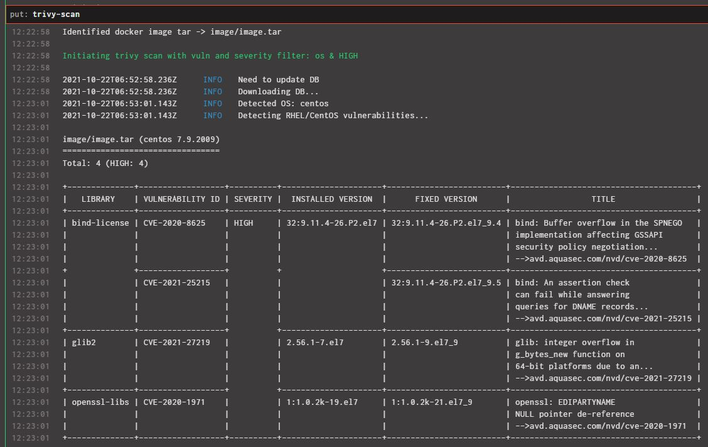
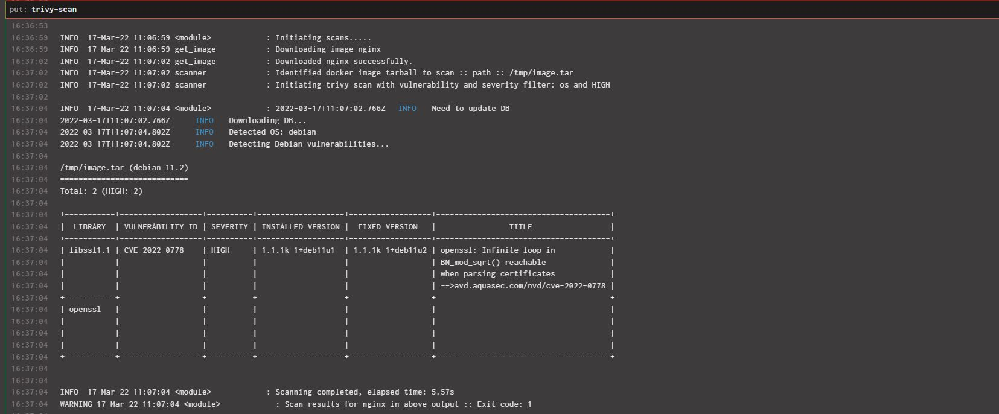

# Trivy Concourse Resource

Scans docker image for os and library vunerabilities using [Trivy](https://aquasecurity.github.io/trivy/v0.19.2/).
## Index

[Source Configuration](#source-configuration)

[Behaviour](#behavior)

[Parameters](#parameters)

[Resource type](#resource-type)

[Resource](#resource)

[Development](#development)

[Building Docker image](#building-docker-image)

[Screenshots](#screenshots)

### Note

>This resource makes use of [Skopeo](https://github.com/containers/skopeo) to download docker images from registry _dockerlessly_. This 
is installed from alpine repo. 
Skopeo is used to have a weightless resource and to operate _rootlessly_.

Please follow [official Trivy documentation](https://aquasecurity.github.io/trivy/v0.19.2/getting-started/quickstart) to know more about os vulnerability scanning of docker images

## Source Configuration

The configurations are split between source and params. The source configurations are earmarked such that they might 
remain common throughout the pipeline, example output format of resource.

The params on the other hand can be tweaked per call. Example the tar file path to scan

* `type`: *Optional.* Scans either os or library vulns. Library vulns would require package.json or similar. Runs 
  scan for `os` by default.

* `json_server`: *Optional.* Ships/POSTs scan results to a json server url provided here

* `format`: *Optional.* scan output format, takes value `json|table`, by default outputs the scan results as table

* `image`: *Optional, if `path` parameter defined.* Image to be scanned from registry. The specified image will be 
  downloaded as docker archive and scanned, might need credentials if registry pull needs authentication. 

* `user`: *Optional, if `path` parameter defined.* Docker registry username if required

* `password`: *Optional, if `path` parameter defined.* Docker registry password if required

## Behavior

### `check`

Currently, a no-op

### `in`

Currently, a no-op

### `out`: Runs the trivy vuln scanner


#### Parameters

* `path`: *Required.* Path to OCI image tarball that is to be scanned for vulnerabilities

* `fail`: *Optional.* Fails if vuln matches the given parameter, takes `HIGH|CRITICAL|MEDIUM|LOW` for values (case-insensitive). Multiple 
  values can be comma separated. By default, runs scan for all the vuln types, and would have exit code `0`. If any 
  fail option is specified, will have exit code `1` if there's vulnerabilities found of the type in scan.

## Example

These examples are excerpts from the test pipelines. To use this resource, its assumed that the image is built using 
[OCI build task](https://github.com/concourse/oci-build-task#migrating-from-the-docker-image-resource) for `image_tar` 
scanning. As of now 
OCI built tar-balls and docker images are supported for scan. Images specified in source config will be downloaded 
as docker-archive and scanned 
Image tar can also be created using [docker 
save]
(https://docs.docker.com/engine/reference/commandline/save) command.

**Note:** Its recommended tagging an image as `latest` in addition to the normal tagging during each build so that the scan 
happens on the updated image everytime

### Resource Type

``` yaml
- name: trivy
  type: docker-image
  source:
    repository: <docker-registry-namespace>/trivy-resource #registry url and namespace where the resource image is pushed to
```

### Resource

``` yaml
- name: trivy-scan
  type: trivy
  source:
    image: <docker-registry-namespace>/test # image that needs to be scanned
  check_every: 24h
```
**Note:** In order to enable the use of trivy scans, so it can be quality gated via the pipeline, there are a few
source configs that are necessary. These just ensure that the pipeline will be interrupted on the finding of 
vulnerabilities

### Plan

#### Trivy scans after OCI build

``` yaml
jobs:
- name: build-release
  public: true
  plan:
  - in_parallel:
    - get: main-src
      trigger: true
  - task: OCI build
    file: path/to/OCI/build/task # outputs image tar-ball
  on_success:
    put: trivy-scan
    params:
      path: image/image.tar
      fail: HIGH
```
The above example fails the task (exit code `1`) on finding HIGH os vulnerabilities in the OCI tar. Not mentioning 
anything in the `fail` 
parameter would scan for all vulnerabilities and the stage would pass (exit code `0`).

####**Important:** 
One of `image` or `path` is mandatory for the scan to be done.

[Sample pipeline](example-pipeline.yml)

## Development

Prerequisites:
* python is required - version 3.8.10 is tested; earlier versions (3.x.x) may also work
* docker is required - version 20.10.7 is tested; earlier versions may also work.

To use the newly built image, push it to a docker registry that's accessible to
Concourse and configure your pipeline to use it:
Make sure to [force-recheck the resource type](https://concourse-ci.org/managing-resource-types.html#fly-check-resource-type) for the new changes to reflect


## Building Docker image

To build docker image of the resource, execute the following command.
The docker command should be executed on the path that has the `Dockerfile`

`docker build -t <docker-registry>/<namespace>/trivy-resource:<tag>`

Please make sure the user is authenticated against the respective docker registry

The build image has to be pushed to registry before using the same in concourse. 

`docker push <docker-registry>/<namespace>/trivy-resource:<tag>`

Docker References:

[Docker login](https://docs.docker.com/engine/reference/commandline/login/),
[Docker tag](https://docs.docker.com/engine/reference/commandline/tag/),
[Docker build](https://docs.docker.com/engine/reference/commandline/build/)
[Docker push](https://docs.docker.com/engine/reference/commandline/push/)

## Screenshots

#### Scans passing in concourse



#### Scans failing at `HIGH` vulns in concourse



#### Nginx downloaded from hub and scanned


